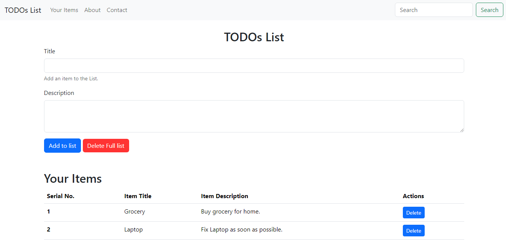

# TODOs List Web App

This repository contains a simple web application for managing your TODO list. It allows you to create, view, and delete tasks easily. The application is built using HTML, CSS, and JavaScript.

## Preview



## Features

- **Add Tasks:** Easily add tasks to your list with titles and descriptions.
- **Manage Tasks:** View, edit, and delete individual tasks as needed.
- **Clear All:** Remove all tasks from your list with a single click.
- **Responsive:** Designed to work seamlessly on various screen sizes.
- **Search:** Search Tasks from the List.

## Getting Started

Getting started with this project is straightforward:

1. Clone this repository to your local machine.
   ```sh
   git clone https://github.com/MuhammadAmmarAtique/ToDo-List
   ```

2. Open the `index.html` file in your web browser.

Explore the code, customize it to fit your needs, or use it as a learning resource to improve your web development skills.

## License

This project is open-source and licensed under the MIT License.

**Disclaimer:**
The content of this website is fictional and is intended for demonstration purposes only.

**Feel free to modify and customize the project to further develop your HTML, CSS, and JavaScript skills!**
